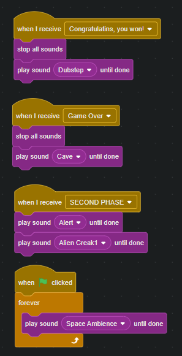

# CS50x-Week0-my-solution-and-notes
# Introduction
Space Adventures is an interactive Scratch game where players control a spaceship, avoiding obstacles and collecting points to achieve high scores. Experience thrilling gameplay with intuitive controls and dynamic challenges in this engaging space-themed adventure. This game is hard and consists of 2 phases, will you try to beat it?

## Features
- **Interactive Gameplay:** Players control a spaceship navigating through space using intuitive controls.
- **Obstacle Avoidance:** Players must avoid various obstacles to survive, adding dynamic challenges to the game.
- **Point Collection:** Points are collected by destroying obstacles, encouraging skillful play.
- **Score Tracking:** The game keeps track of the highest score achieved, motivating players to beat their previous records.
- **High-Quality Musical Accompaniment:** Various musical compositions enhance the gameplay experience, triggered by special events.
- **Enemy Spaceship:** In the second stage, a special enemy spaceship appears and glides towards the player, adding an additional layer of challenge.
- **Super Fire:** Every 10 shots, a super fire is launched that can destroy all objects in its path quickly and efficiently.
  
## How to Play
1. **Start the Game:** Open the Space Adventures project in Scratch.
2. **Controls:** Use the arrow keys to move the spaceship up, down, left, and right.
3. **Objective:** Avoid obstacles and collect points to achieve the highest score.
4. **End of Game:** The game ends when the spaceship crashes into an obstacle. The final score is displayed.
5. **How to win** To win the game 100 points should be obtained.

## Installation
To play Space Adventures, follow these steps:
1. **Download Scratch:** If you haven't already, download and install Scratch from [Scratch's official website](https://scratch.mit.edu/download).
2. **Open the Project:** Download the Space Adventures project file (`Space Adventures.sb3`) and open it in Scratch.

## Gameplay Mechanics
- **Spaceship Movement:** Use the arrow keys to move the spaceship up, down, left, and right.
- **Obstacle Generation:** Obstacles appear randomly with varying sizes and move towards the spaceship, requiring quick reflexes.
- **Enemy Spaceship:** The enemy spaceship appears in the second stage and steadily moves towards the player's spaceship, forcing evasive maneuvers.
- **Super Fire:** After every 10 shots, a powerful super fire is activated, passing through and destroying all obstacles rapidly.
- **Point System:** Points are awarded for each obstacle destroyed and for the distance traveled, encouraging players to stay alive as long as possible.

## Project Structure

### Stage
- **Role:** Manages the overall game environment, including backgrounds and game states. It also tracks the score and handles game start and end events. The stage controls the transitions between different phases of the game.
- **Costumes:** The stage has different costumes to represent various backgrounds and game states. These may include:
  - **Background 1:** The initial space background for the first phase of the game.
  - **Background 2:** A different background or a more intense space scene for the second phase when the enemy spaceship appears.

### Sprite1 (Spaceship)
- **Role:** The player's controllable spaceship. Handles movement using arrow keys and shooting projectiles to destroy obstacles. It is the primary element the player interacts with.

### Rocks
- **Role:** Represents the obstacles in the game. These rocks appear randomly and move towards the player's spaceship. The player must avoid or destroy these rocks to survive.

### Enemy Spaceship
- **Role:** A special enemy that appears in the second phase of the game. It steadily moves towards the player's spaceship, adding an additional layer of challenge that the player must evade.

### Letter Sprites
- **Role:** Display messages indicating game status, such as win/loss, game over, or instructional text. These sprites are shown at various points during the game.
- **Costumes:** Each letter sprite has a costume that displays a specific letter or message component. For example:
  - **Y, O, U, W, O, N:** Sprites that spell out "YOU WON" when the winning condition is met.
  - **G, A, M, E, O, V, E, R:** Sprites that spell out "GAME OVER" at the end of the game.
 
### Button1 (Bullets)
- **Role:** Represents the bullets fired by the player's spaceship. These bullets are used to destroy obstacles (rocks) and enemy spaceships. The `Button1` sprite handles the shooting mechanics, including bullet movement and collision detection.

### Super Fire
- **Role:** A powerful shot that the player's spaceship can fire every 10 shots. It passes through and destroys all obstacles in its path, providing a temporary advantage.\

### Game Phases
- **Phase 1:** The game starts with the player controlling the spaceship and avoiding rocks that appear randomly. The main objective is to survive and collect points by destroying obstacles.
- **Phase 2:** After a certain score threshold is reached, the game transitions to the second phase. In this phase, the enemy spaceship appears and starts gliding towards the player's spaceship. The player must continue avoiding rocks while also evading the enemy spaceship, increasing the difficulty of the game.

## Technical Details

### Techniques Used
- **Event-Driven Programming:** The game heavily relies on event-driven programming, using Scratch's broadcasting and event listening features to manage game states and transitions.
- **Randomization:** Random functions are used to generate obstacles at random positions and with random sizes to ensure the game remains unpredictable and challenging.
- **Collision Detection:** Scratch's built-in collision detection is used to manage interactions between the spaceship, bullets, and obstacles.
- **State Management:** Variables are used to keep track of game states such as score, game phase, and bullet count.
- **Message Broadcasting:** Scratch's message broadcasting system is used to trigger changes between game phases and to handle the appearance of messages like "Game Over" and "You Won".

### Implementation of Mechanics

#### Spaceship Movement
The spaceship is controlled using the arrow keys. The scripts attached to the spaceship sprite listen for key press events and move the spaceship accordingly:
- **Up Arrow:** Moves the spaceship up.
- **Down Arrow:** Moves the spaceship down.
- **Left Arrow:** Moves the spaceship left.
- **Right Arrow:** Moves the spaceship right.

#### Shooting Bullets
The player can shoot bullets by pressing the spacebar. Each time the spacebar is pressed, a bullet sprite (`Button1`) is cloned and set to move forward from the spaceship's position:
- **Bullet Creation:** A new clone of the `Button1` sprite is created.
- **Bullet Movement:** The cloned bullet moves forward until it collides with an obstacle or goes off-screen.
- **Collision Handling:** When a bullet collides with an obstacle, both the bullet and the obstacle are destroyed, and the player earns points.

#### Super Fire Mechanism
Every 10 shots, a super fire is activated which destroys all obstacles in its path:
- **Super Fire Activation:** A counter keeps track of the number of bullets fired. When it reaches 10, a super fire is triggered.
- **Super Fire Behavior:** The super fire moves quickly across the screen, destroying any obstacles it touches.

#### Obstacle Generation
Obstacles (rocks) are generated at random intervals and positions:
- **Random Positioning:** Obstacles appear at random positions on the right edge of the screen.
- **Random Sizes:** Obstacles are assigned random sizes to add variety and difficulty.
- **Movement:** Obstacles move leftward towards the spaceship, increasing the challenge for the player.

#### Enemy Spaceship
In the second phase of the game, an enemy spaceship appears and glides towards the player’s spaceship:
- **Appearance Trigger:** The enemy spaceship appears once a certain score threshold is reached.
- **Movement:** The enemy spaceship steadily moves towards the player’s spaceship, forcing the player to evade it while still avoiding obstacles.

## Explanation of Broadcast Events

1. **Event: "Congratulations, you won!"**
    - **Actions:**
        - Stops all current sounds.
        - Plays the "Dubstep" sound until it is completed.
    - **Purpose:** To provide a celebratory audio cue when the player wins the game.

2. **Event: "Game Over"**
    - **Actions:**
        - Stops all current sounds.
        - Plays the "Cave" sound until it is completed.
    - **Purpose:** To signal to the player that the game has ended with a distinct sound.

3. **Event: "SECOND PHASE"**
    - **Actions:**
        - Plays the "Alert" sound until it is completed.
        - Plays the "Alien Creak1" sound until it is completed.
    - **Purpose:** To indicate the start of a new phase in the game with a combination of alerting and eerie sounds.

4. **Event: When the green flag is clicked**
    - **Actions:**
        - Repeatedly plays the "Space Ambience" sound.
    - **Purpose:** To provide continuous background ambiance, immersing the player in a space-themed environment throughout the game.
The syntax is simple, when the sygnal about event will gone, other actions will be played. Something like If condition is met, do this. And songs will start playing. Forever loop means, it will always launch the music another time, when it meets it's end.

This image shows the setup process for initializing the enemy spaceship in the game. The blocks are designed to position the spaceship correctly and hide it at the start of the game. Here's what each block does:
      1. **Event: When the green flag is clicked**
          - **Purpose:** This block is triggered when the game starts (or is restarted). It ensures that the following actions happen right at the beginning of the game.

      2. **Block: Go to x: 180 y: 150**
          - **Action:** This block moves the enemy spaceship to a specific position on the screen, with coordinates (180, 150). 
          - **Purpose:** Setting the initial position of the spaceship so that it starts from a predefined location, ensuring consistent gameplay each time the game begins.

      3. **Block: Hide**
          - **Action:** This block makes the enemy spaceship invisible.
          - **Purpose:** Initially hiding the spaceship until it's needed in the game. This can be useful for setting up the game environment without showing all elements right away, creating a more controlled and engaging experience for the player.
      Together, these blocks ensure that the enemy spaceship is placed correctly and hidden when the game starts, ready to be revealed at the appropriate moment in the gameplay.
