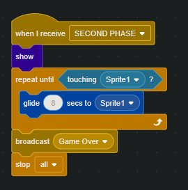

# CS50x-Week0-my-solution-and-notes
# Introduction
Space Adventures is an interactive Scratch game where players control a spaceship, avoiding obstacles and collecting points to achieve high scores. Experience thrilling gameplay with intuitive controls and dynamic challenges in this engaging space-themed adventure. This game is hard and consists of 2 phases, will you try to beat it?

## Features
- **Interactive Gameplay:** Players control a spaceship navigating through space using intuitive controls.
- **Obstacle Avoidance:** Players must avoid various obstacles to survive, adding dynamic challenges to the game.
- **Point Collection:** Points are collected by destroying obstacles, encouraging skillful play.
- **Score Tracking:** The game keeps track of the highest score achieved, motivating players to beat their previous records.
- **High-Quality Musical Accompaniment:** Various musical compositions enhance the gameplay experience, triggered by special events.
- **Enemy Spaceship:** In the second stage, a special enemy spaceship appears and glides towards the player, adding an additional layer of challenge.
- **Super Fire:** Every 10 shots, a super fire is launched that can destroy all objects in its path quickly and efficiently.
  
## How to Play
1. **Start the Game:** Open the Space Adventures project in Scratch.
2. **Controls:** Use the arrow keys to move the spaceship up, down, left, and right.
3. **Objective:** Avoid obstacles and collect points to achieve the highest score.
4. **End of Game:** The game ends when the spaceship crashes into an obstacle. The final score is displayed.
5. **How to win** To win the game 100 points should be obtained.

## Installation
To play Space Adventures, follow these steps:
1. **Download Scratch:** If you haven't already, download and install Scratch from [Scratch's official website](https://scratch.mit.edu/download).
2. **Open the Project:** Download the Space Adventures project file (`Space Adventures.sb3`) and open it in Scratch.

## Gameplay Mechanics
- **Spaceship Movement:** Use the arrow keys to move the spaceship up, down, left, and right.
- **Obstacle Generation:** Obstacles appear randomly with varying sizes and move towards the spaceship, requiring quick reflexes.
- **Enemy Spaceship:** The enemy spaceship appears in the second stage and steadily moves towards the player's spaceship, forcing evasive maneuvers.
- **Super Fire:** After every 10 shots, a powerful super fire is activated, passing through and destroying all obstacles rapidly.
- **Point System:** Points are awarded for each obstacle destroyed and for the distance traveled, encouraging players to stay alive as long as possible.

## Project Structure

### Stage
- **Role:** Manages the overall game environment, including backgrounds and game states. It also tracks the score and handles game start and end events. The stage controls the transitions between different phases of the game.
- **Costumes:** The stage has different costumes to represent various backgrounds and game states. These may include:
  - **Background 1:** The initial space background for the first phase of the game.
  - **Background 2:** A different background or a more intense space scene for the second phase when the enemy spaceship appears.

### Sprite1 (Spaceship)
- **Role:** The player's controllable spaceship. Handles movement using arrow keys and shooting projectiles to destroy obstacles. It is the primary element the player interacts with.

### Rocks
- **Role:** Represents the obstacles in the game. These rocks appear randomly and move towards the player's spaceship. The player must avoid or destroy these rocks to survive.

### Enemy Spaceship
- **Role:** A special enemy that appears in the second phase of the game. It steadily moves towards the player's spaceship, adding an additional layer of challenge that the player must evade.

### Letter Sprites
- **Role:** Display messages indicating game status, such as win/loss, game over, or instructional text. These sprites are shown at various points during the game.
- **Costumes:** Each letter sprite has a costume that displays a specific letter or message component. For example:
  - **Y, O, U, W, O, N:** Sprites that spell out "YOU WON" when the winning condition is met.
  - **G, A, M, E, O, V, E, R:** Sprites that spell out "GAME OVER" at the end of the game.
 
### Button1 (Bullets)
- **Role:** Represents the bullets fired by the player's spaceship. These bullets are used to destroy obstacles (rocks) and enemy spaceships. The `Button1` sprite handles the shooting mechanics, including bullet movement and collision detection.

### Super Fire
- **Role:** A powerful shot that the player's spaceship can fire every 10 shots. It passes through and destroys all obstacles in its path, providing a temporary advantage.\

### Game Phases
- **Phase 1:** The game starts with the player controlling the spaceship and avoiding rocks that appear randomly. The main objective is to survive and collect points by destroying obstacles.
- **Phase 2:** After a certain score threshold is reached, the game transitions to the second phase. In this phase, the enemy spaceship appears and starts gliding towards the player's spaceship. The player must continue avoiding rocks while also evading the enemy spaceship, increasing the difficulty of the game.

## Technical Details

### Techniques Used
- **Event-Driven Programming:** The game heavily relies on event-driven programming, using Scratch's broadcasting and event listening features to manage game states and transitions.
- **Randomization:** Random functions are used to generate obstacles at random positions and with random sizes to ensure the game remains unpredictable and challenging.
- **Collision Detection:** Scratch's built-in collision detection is used to manage interactions between the spaceship, bullets, and obstacles.
- **State Management:** Variables are used to keep track of game states such as score, game phase, and bullet count.
- **Message Broadcasting:** Scratch's message broadcasting system is used to trigger changes between game phases and to handle the appearance of messages like "Game Over" and "You Won".

### Implementation of Mechanics

#### Spaceship Movement
The spaceship is controlled using the arrow keys. The scripts attached to the spaceship sprite listen for key press events and move the spaceship accordingly:
- **Up Arrow:** Moves the spaceship up.
- **Down Arrow:** Moves the spaceship down.
- **Left Arrow:** Moves the spaceship left.
- **Right Arrow:** Moves the spaceship right.

#### Shooting Bullets
The player can shoot bullets by pressing the spacebar. Each time the spacebar is pressed, a bullet sprite (`Button1`) is cloned and set to move forward from the spaceship's position:
- **Bullet Creation:** A new clone of the `Button1` sprite is created.
- **Bullet Movement:** The cloned bullet moves forward until it collides with an obstacle or goes off-screen.
- **Collision Handling:** When a bullet collides with an obstacle, both the bullet and the obstacle are destroyed, and the player earns points.

#### Super Fire Mechanism
Every 10 shots, a super fire is activated which destroys all obstacles in its path:
- **Super Fire Activation:** A counter keeps track of the number of bullets fired. When it reaches 10, a super fire is triggered.
- **Super Fire Behavior:** The super fire moves quickly across the screen, destroying any obstacles it touches.

#### Obstacle Generation
Obstacles (rocks) are generated at random intervals and positions:
- **Random Positioning:** Obstacles appear at random positions on the right edge of the screen.
- **Random Sizes:** Obstacles are assigned random sizes to add variety and difficulty.
- **Movement:** Obstacles move leftward towards the spaceship, increasing the challenge for the player.

#### Enemy Spaceship
In the second phase of the game, an enemy spaceship appears and glides towards the player’s spaceship:
- **Appearance Trigger:** The enemy spaceship appears once a certain score threshold is reached.
- **Movement:** The enemy spaceship steadily moves towards the player’s spaceship, forcing the player to evade it while still avoiding obstacles.

## Explanation of the code

### Sound, end-game events
<table>
  <tr>
    <td></td>
    <td>
      <ol>
        <li><strong>Event: "Congratulations, you won!"</strong>
          <ul>
            <li><strong>Actions:</strong> Stops all current sounds. Plays the "Dubstep" sound until it is completed.</li>
            <li><strong>Purpose:</strong> To provide a celebratory audio cue when the player wins the game.</li>
          </ul>
        </li>
        <li>Event: "Game Over"
          <ul>
            <li>Actions:
              <ul>
                <li>Stops all current sounds.</li>
                <li>Plays the "Cave" sound until it is completed.</li>
              </ul>
            </li>
            <li>Purpose: To signal to the player that the game has ended with a distinct sound.</li>
          </ul>
        </li>
        <li>Event: "SECOND PHASE"
          <ul>
            <li>Actions:
              <ul>
                <li>Plays the "Alert" sound until it is completed.</li>
                <li>Plays the "Alien Creak1" sound until it is completed.</li>
              </ul>
            </li>
            <li>Purpose: To indicate the start of a new phase in the game with a combination of alerting and eerie sounds.</li>
          </ul>
        </li>
        <li>Event: When the green flag is clicked
          <ul>
            <li>Actions:
              <ul>
                <li>Repeatedly plays the "Space Ambience" sound.</li>
              </ul>
            </li>
            <li>Purpose: To provide continuous background ambiance, immersing the player in a space-themed environment throughout the game. The syntax is simple, when the signal about event is gone, other actions will be played. Something like If condition is met, do this. And songs will start playing. Forever loop means, it will always launch the music another time, when it meets it's end.</li>
          </ul>
        </li>
        
The syntax is simple, when the sygnal about event will gone, other actions will be played. Something like If condition is met, do this. And songs will start playing. Forever loop means, it will always launch the music another time, when it meets it's end.

      </ol>
    </td>
  </tr>
</table>

### Enemy Spaceship Base
<table>
  <tr>
    <td></td>
    <td>
      
This image shows the setup process for initializing the enemy spaceship in the game. The blocks are designed to position the spaceship correctly and hide it at the start of the game. Here's what each block does:

      <ol>
        <li><strong>Event: When the green flag is clicked</strong>
          <ul>
            <li><strong>Purpose:</strong> This block is triggered when the game starts (or is restarted). It ensures that the following actions happen right at the beginning of the game.</li>
          </ul>
        </li>
        <li><strong>Block: Go to x: 180 y: 150</strong>
          <ul>
            <li><strong>Action:</strong> This block moves the enemy spaceship to a specific position on the screen, with coordinates (180, 150).</li>
            <li><strong>Purpose:</strong> Setting the initial position of the spaceship so that it starts from a predefined location, ensuring consistent gameplay each time the game begins.</li>
          </ul>
        </li>
        <li><strong>Block: Hide</strong>
          <ul>
            <li><strong>Action:</strong> This block makes the enemy spaceship invisible.</li>
            <li><strong>Purpose:</strong> Initially hiding the spaceship until it's needed in the game. This can be useful for setting up the game environment without showing all elements right away, creating a more controlled and engaging experience for the player.</li>
          </ul>
        </li>
      </ol>
      
Together, these blocks ensure that the enemy spaceship is placed correctly and hidden when the game starts, ready to be revealed at the appropriate moment in the gameplay.

    </td>
  </tr>
</table>

### Enemy Spaceship Movements
<table>
  <tr>
    <td></td>
    <td>
      
This image shows how the enemy spaceship behaves during the second phase of the game. Each block in the script plays a crucial role in creating a dynamic and engaging challenge for the player. Here's what each part does:

      <ol>
        <li><strong>Event: When I receive "SECOND PHASE"</strong>
          <ul>
            <li><strong>Purpose:</strong> This block is triggered when the game reaches the second phase. It ensures that the following actions start specifically at this stage of the game.</li>
          </ul>
        </li>
        <li><strong>Block: Show</strong>
          <ul>
            <li><strong>Action:</strong> This block makes the enemy spaceship visible.</li>
            <li><strong>Purpose:</strong> To reveal the enemy spaceship at the beginning of the second phase, adding an element of surprise and increasing the difficulty.</li>
          </ul>
        </li>
        <li><strong>Repeat Until: touching "Sprite1"</strong>
          <ul>
            <li><strong>Action:</strong> This block repeats the enclosed actions until the enemy spaceship touches "Sprite1" (which could be the player's spaceship or another target).</li>
            <li><strong>Purpose:</strong> To keep the enemy spaceship moving towards its target until it makes contact, creating a continuous challenge for the player.</li>
          </ul>
        </li>
        <li><strong>Block: Glide 8 secs to "Sprite1"</strong>
          <ul>
            <li><strong>Action:</strong> This block moves the enemy spaceship towards "Sprite1" over a period of 8 seconds.</li>
            <li><strong>Purpose:</strong> To create a smooth, gliding motion towards the target, making the enemy's movement predictable yet challenging to avoid.</li>
          </ul>
        </li>
        <li><strong>Block: Broadcast "Game Over"</strong>
          <ul>
            <li><strong>Action:</strong> This block sends a "Game Over" message when the enemy spaceship touches "Sprite1".</li>
            <li><strong>Purpose:</strong> To trigger the end of the game, indicating that the player has been caught by the enemy spaceship.</li>
          </ul>
        </li>
        <li><strong>Block: Stop all</strong>
          <ul>
            <li><strong>Action:</strong> This block stops all scripts in the game.</li>
            <li><strong>Purpose:</strong> To halt all game activities immediately after the game is over, ensuring a clear and definitive end to the game session.</li>
          </ul>
        </li>
      </ol>
      
This script ensures that the enemy spaceship appears and actively targets the player during the second phase, creating a tense and exciting gameplay experience.

    </td>
  </tr>
</table>

### Letters Visibility 
<table>
  <tr>
    <td></td>
    <td>
      
This image shows two separate scripts that control the visibility of letters in the game, both when the game starts and when it ends. Here's what each block does:

      <ol>
        <li><strong>Event: When I receive "Game Over"</strong>
          <ul>
            <li><strong>Action:</strong> This block is triggered when the game sends a "Game Over" message.</li>
            <li><strong>Block: Show</strong>
              <ul>
                <li><strong>Action:</strong> Makes the letters visible.</li>
                <li><strong>Purpose:</strong> To display the letters on the screen when the game ends, possibly to spell out a "Game Over" message for the player.</li>
              </ul>
            </li>
          </ul>
        </li>
        <li><strong>Event: When the green flag is clicked</strong>
          <ul>
            <li><strong>Action:</strong> This block is triggered when the game starts (or is restarted).</li>
            <li><strong>Block: Hide</strong>
              <ul>
                <li><strong>Action:</strong> Hides the letters.</li>
                <li><strong>Purpose:</strong> To ensure that the letters are not visible when the game starts, keeping the screen clear until they are needed (like when the game ends).</li>
              </ul>
            </li>
          </ul>
        </li>
      </ol>
      
These scripts manage the visibility of the letters in the game, ensuring they only appear at the appropriate times to communicate the game status effectively to the player.

    </td>
  </tr>
</table>

### Spaceship Movements
<table>
  <tr>
    <td></td>
    <td>
      
This image shows a script that allows the player to control the movement of a spaceship using the keyboard. Each block checks for a specific key press and moves the spaceship accordingly. Here's how it works:

      <ol>
        <li><strong>Event: When the green flag is clicked</strong>
          <ul>
            <li><strong>Action:</strong> This block is triggered when the game starts (or is restarted).</li>
            <li><strong>Purpose:</strong> To initialize the control script, making sure the spaceship can be moved as soon as the game begins.</li>
          </ul>
        </li>
        <li><strong>Forever Loop</strong>
          <ul>
            <li><strong>Action:</strong> This block continuously checks for key presses.</li>
            <li><strong>Purpose:</strong> To allow continuous movement of the spaceship as long as the game is running.</li>
          </ul>
        </li>
        <li><strong>If key "w" pressed?</strong>
          <ul>
            <li><strong>Action:</strong> Checks if the "w" key is pressed.</li>
            <li><strong>Block: Change y by 5</strong>
              <ul>
                <li><strong>Action:</strong> Moves the spaceship up by 5 units.</li>
                <li><strong>Purpose:</strong> To move the spaceship up when the "w" key is pressed, simulating forward movement.</li>
              </ul>
            </li>
          </ul>
        </li>
        <li><strong>If key "a" pressed?</strong>
          <ul>
            <li><strong>Action:</strong> Checks if the "a" key is pressed.</li>
            <li><strong>Block: Change x by -5</strong>
              <ul>
                <li><strong>Action:</strong> Moves the spaceship left by 5 units.</li>
                <li><strong>Purpose:</strong> To move the spaceship left when the "a" key is pressed, simulating leftward movement.</li>
              </ul>
            </li>
          </ul>
        </li>
        <li><strong>If key "s" pressed?</strong>
          <ul>
            <li><strong>Action:</strong> Checks if the "s" key is pressed.</li>
            <li><strong>Block: Change y by -5</strong>
              <ul>
                <li><strong>Action:</strong> Moves the spaceship down by 5 units.</li>
                <li><strong>Purpose:</strong> To move the spaceship down when the "s" key is pressed, simulating backward movement.</li>
              </ul>
            </li>
          </ul>
        </li>
        <li><strong>If key "d" pressed?</strong>
          <ul>
            <li><strong>Action:</strong> Checks if the "d" key is pressed.</li>
            <li><strong>Block: Change x by 5</strong>
              <ul>
                <li><strong>Action:</strong> Moves the spaceship right by 5 units.</li>
                <li><strong>Purpose:</strong> To move the spaceship right when the "d" key is pressed, simulating rightward movement.</li>
              </ul>
            </li>
          </ul>
        </li>
      </ol>
      
This script provides basic but effective keyboard controls for moving the spaceship in four directions, enhancing the player's ability to navigate the game environment.

    </td>
  </tr>
</table>

### Rocks Function
<table>
  <tr>
    <td></td>
    <td>
      
This image shows a custom function called "rocks" that manages the behavior of rocks in the game. This function handles their movement, interactions with the edges of the screen, and interactions with buttons. Here's a breakdown of what each part does:

      <ol>
        <li><strong>Define "rocks"</strong>
          <ul>
            <li><strong>Purpose:</strong> This block defines a custom function named "rocks." The actions within this function can be reused whenever this function is called in the game.</li>
          </ul>
        </li>
        <li><strong>If touching edge?</strong>
          <ul>
            <li><strong>Action:</strong> Checks if a rock is touching the edge of the screen.</li>
            <li><strong>Block: Go to x: (pick random -220 to 220) y: 150</strong>
              <ul>
                <li><strong>Action:</strong> Moves the rock to a random horizontal position at the top of the screen.</li>
                <li><strong>Purpose:</strong> To reset the rock's position when it touches the edge, making it appear at the top again to fall down.</li>
              </ul>
            </li>
          </ul>
        </li>
        <li><strong>If touching Button2 or touching Button3?</strong>
          <ul>
            <li><strong>Action:</strong> Checks if a rock is touching either Button2 or Button3.</li>
            <li><strong>Block: Go to x: (pick random -220 to 220) y: 150</strong>
              <ul>
                <li><strong>Action:</strong> Moves the rock to a random horizontal position at the top of the screen.</li>
                <li><strong>Purpose:</strong> To reset the rock's position when it touches a button, making it appear at the top again to fall down.</li>
              </ul>
            </li>
          </ul>
        </li>
        <li><strong>Set pitch effect to (pick random 1 to 100)</strong>
          <ul>
            <li><strong>Action:</strong> Changes the pitch effect to a random value between 1 and 100.</li>
            <li><strong>Purpose:</strong> To create a variety of sound effects when the rock interacts with a button, adding auditory interest to the game.</li>
          </ul>
        </li>
        <li><strong>Start sound "pop"</strong>
          <ul>
            <li><strong>Action:</strong> Plays the "pop" sound.</li>
            <li><strong>Purpose:</strong> To provide immediate audio feedback when the rock touches a button, enhancing the player's experience.</li>
          </ul>
        </li>
        <li><strong>Change whirl effect by 25</strong>
          <ul>
            <li><strong>Action:</strong> Applies a whirl effect to the rock, increasing the effect by 25.</li>
            <li><strong>Purpose:</strong> To visually indicate the interaction, making the game more visually engaging.</li>
          </ul>
        </li>
        <li><strong>Change score by 1</strong>
          <ul>
            <li><strong>Action:</strong> Increases the player's score by 1.</li>
            <li><strong>Purpose:</strong> To reward the player for successful interactions with the buttons, providing a sense of achievement and progress.</li>
          </ul>
        </li>
      </ol>
      
This function ensures that rocks in the game have dynamic interactions with the screen edges and buttons, providing both visual and auditory feedback while also contributing to the game's scoring system.

    </td>
  </tr>
</table>

### Shooting Mechanism
<table>
  <tr>
    <td></td>
    <td>
      <h3>Shooting Mechanism Code Explanation</h3>
      
This code block manages the shooting mechanism for a sprite in a game. It defines the behavior when the green flag is clicked and continuously monitors for the space key to be pressed, triggering the shooting action.

      <ul>
        <li><strong>When the green flag is clicked:</strong>
          <ul>
            <li><strong>Forever loop:</strong>
              <ul>
                <li><strong>hide:</strong> Initially hides the sprite to manage its visibility during gameplay.</li>
                <li><strong>go to Sprite1:</strong> Positions the sprite at the location of Sprite1.</li>
                <li><strong>change y by 5:</strong> Moves the sprite upward by 5 units.</li>
                <li><strong>If the space key is pressed:</strong>
                  <ul>
                    <li><strong>wait 0.1 seconds:</strong> Introduces a brief delay between shots.</li>
                    <li><strong>repeat 1:</strong> Repeats the following actions once:
                      <ul>
                        <li><strong>create clone of myself:</strong> Creates a clone of the current sprite.</li>
                        <li><strong>play sound "Laser2" until done:</strong> Plays the "Laser2" sound effect to simulate shooting.</li>
                      </ul>
                    </li>
                    <li><strong>change "firesuntilmegafire" by -1:</strong> Decrements the counter for shots until the mega fire mode is triggered.</li>
                    <li><strong>If "firesuntilmegafire" equals 0:</strong> Checks if the counter has reached zero.
                      <ul>
                        <li><strong>repeat 1:</strong> Repeats the following actions once:
                          <ul>
                            <li><strong>create clone of Button3:</strong> Creates a clone of Button3, possibly for a special shooting action or power-up.</li>
                            <li><strong>set "firesuntilmegafire" to 10:</strong> Resets the counter to 10 for the next cycle of shots.</li>
                          </ul>
                        </li>
                      </ul>
                    </li>
                  </ul>
                </li>
              </ul>
            </li>
          </ul>
        </li>
      </ul>
    </td>
  </tr>
</table>

### Bullet Clone Initialization Code
<table>
  <tr>
    <td></td>
    <td>
      <h3>Clone Initialization Code Explanation</h3>
      
This code block defines the behavior for a sprite when it starts as a clone. It manages the movement, interactions, and events triggered by the clone during the game.

      <ul>
        <li><strong>When I start as a clone:</strong>
          <ul>
            <li><strong>show:</strong> Makes the clone visible.</li>
            <li><strong>go to x: (pick random -220 to 220) y: 150:</strong> Positions the clone at a random x-coordinate within the range -220 to 220 and at y-coordinate 150.</li>
            <li><strong>repeat until touching Sprite1:</strong>
              <ul>
                <li>Continuously moves the clone downward until it touches Sprite1.</li>
                <li><strong>set speeeeeeed to (pick random -1 to -10):</strong> Sets the speed of the clone to a random value between -1 and -10.</li>
                <li><strong>change y by speeeeeeed:</strong> Moves the clone downward by the set speed value.</li>
              </ul>
            </li>
            <li><strong>rocks:</strong> Executes the custom "rocks" function, which defines additional behaviors (not fully shown in this block).</li>
            <li><strong>If score = 50 then:</strong> Checks if the score is equal to 50.
              <ul>
                <li><strong>switch backdrop to Galaxy:</strong> Changes the backdrop to "Galaxy".</li>
                <li><strong>broadcast SECOND PHASE:</strong> Sends a broadcast message to initiate the second phase of the game.</li>
              </ul>
            </li>
            <li><strong>If score > 150 then:</strong> Checks if the score is greater than 150.
              <ul>
                <li><strong>broadcast Congratulatins, you won!:</strong> Sends a broadcast message indicating that the player has won the game.</li>
                <li><strong>stop all:</strong> Stops all scripts, effectively ending the game.</li>
              </ul>
            </li>
            <li><strong>broadcast Game Over:</strong> Sends a broadcast message indicating that the game is over.</li>
            <li><strong>stop all:</strong> Stops all scripts, effectively ending the game.</li>
          </ul>
        </li>
      </ul>
    </td>
  </tr>
</table>

### Rock Clones Behaviour
<table>
  <tr>
    <td></td>
    <td>
      <h3>Clone Behavior Code Explanation</h3>
      
This code block defines the behavior for a sprite when it starts as a clone. It manages the movement and interactions of the clone in the game.

      <ul>
        <li><strong>When I start as a clone:</strong>
          <ul>
            <li><strong>show:</strong> Makes the clone visible.</li>
            <li><strong>repeat until touching edge or touching Rocks:</strong>
              <ul>
                <li>The clone keeps moving downward until it touches the edge of the screen or another sprite named "Rocks".</li>
                <li><strong>change y by 5:</strong> Moves the clone downward by 5 units continuously.</li>
              </ul>
            </li>
            <li><strong>hide:</strong> Hides the clone once the repeat condition is met.</li>
          </ul>
        </li>
      </ul>
    </td>
  </tr>
</table>

### Game start
<table>
  <tr>
    <td></td>
    <td>
      <h3>Game Start Code Explanation</h3>
      
This code block defines the actions that occur when the green flag is clicked, typically indicating the start of the game.

      <ul>
        <li><strong>When green flag clicked:</strong>
          <ul>
            <li><strong>play sound Space Ripple until done:</strong> Plays the "Space Ripple" sound effect completely before moving to the next block.</li>
            <li><strong>switch backdrop to Stars:</strong> Changes the background of the stage to "Stars".</li>
            <li><strong>hide:</strong> Hides the sprite executing this script.</li>
            <li><strong>set score to 0:</strong> Initializes the score to 0 at the start of the game.</li>
            <li><strong>repeat 7:</strong> Repeats the enclosed actions 7 times.
              <ul>
                <li><strong>set size to pick random 30 to 60 %:</strong> Randomly sets the size of the sprite to a value between 30% and 60%.</li>
                <li><strong>create clone of myself:</strong> Creates a clone of the sprite executing this script.</li>
              </ul>
            </li>
          </ul>
        </li>
      </ul>
    </td>
  </tr>
</table>

### Super Bullet Base
<table>
  <tr>
    <td></td>
    <td>
      <h3>Super Bullet Base Code Explanation</h3>
      
This code block defines the behavior of a sprite, likely a bullet, that follows another sprite continuously.

      <ul>
        <li><strong>When green flag clicked:</strong>
          <ul>
            <li><strong>hide:</strong> Hides the sprite executing this script to start.</li>
            <li><strong>forever:</strong> Repeats the enclosed actions indefinitely.
              <ul>
                <li><strong>go to Sprite1:</strong> Continuously moves the sprite to the location of "Sprite1".</li>
              </ul>
            </li>
          </ul>
        </li>
      </ul>
    </td>
  </tr>
</table>

### Super Bullet Movement
<table>
  <tr>
    <td></td>
    <td>
      <h3>Super Bullet Movement Code Explanation</h3>
      
This code block defines the behavior of a cloned sprite, likely a bullet, that moves vertically until it touches the edge of the screen.

      <ul>
        <li><strong>When I start as a clone:</strong>
          <ul>
            <li><strong>show:</strong> Makes the cloned sprite visible.</li>
            <li><strong>repeat until touching edge:</strong> Repeats the enclosed actions until the sprite touches the edge of the screen.
              <ul>
                <li><strong>change y by 15:</strong> Moves the sprite upward by 15 units each iteration.</li>
              </ul>
            </li>
            <li><strong>hide:</strong> Hides the sprite once it touches the edge of the screen.</li>
          </ul>
        </li>
      </ul>
    </td>
  </tr>
</table>
